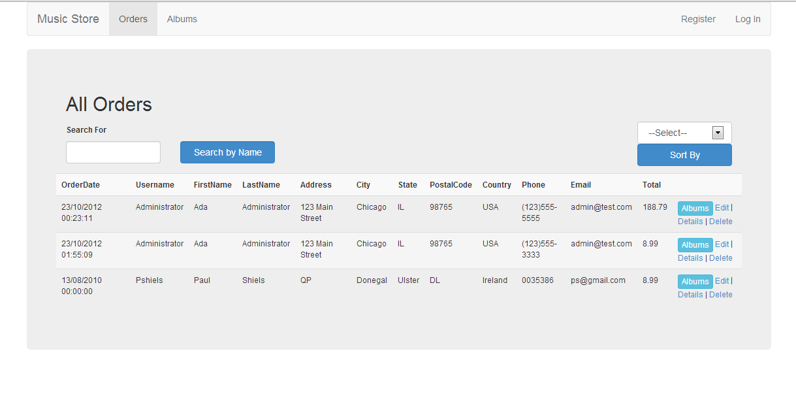
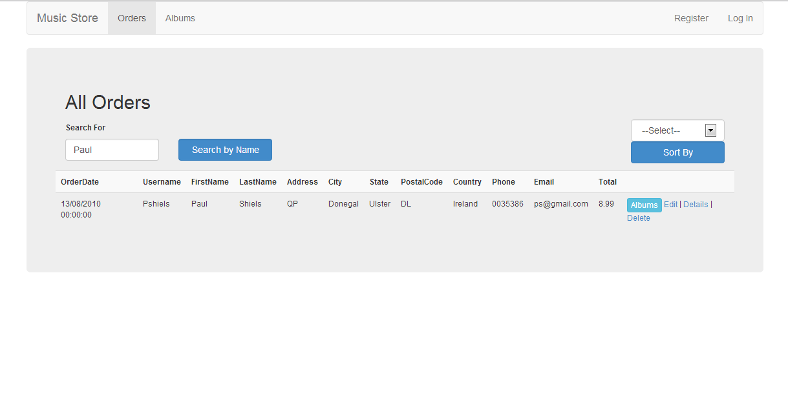
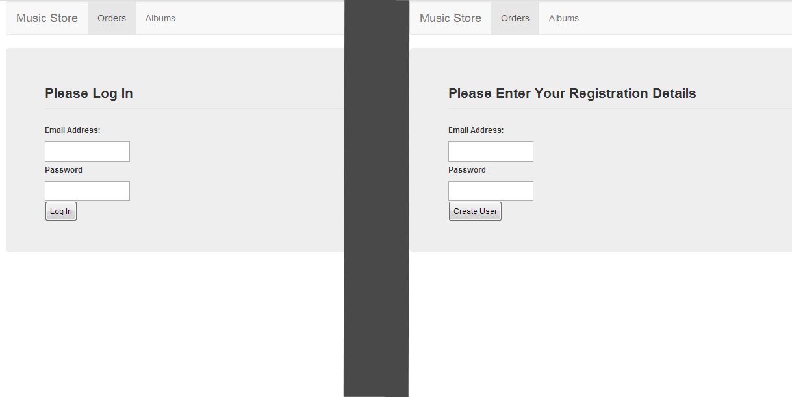

Music Store App
=============================================
Home page displays a list of **Orders** for Albums

Search displays **Orders** of the customer by searching for **First Name**

Sort by sorts the order either by date or by size (value)

The **Albums** button displays all the albums that that customer has ordered.
The **Back** button returns to homepage.
The **Music Store** link return to homepage.
The **Albums** link shows all Albums in order of Artist Name

I added the **Authorize Attribute** method to the filterConfig.cs file to secure the **ActionResult** methods and added **[AllowAnonymous]** to any ActionResult methods that did not need secured.  
Also added **[ValidateAntiForgeryToken]** to post ActionResult methods to help prevent against Cross Site Scripting.

I added new table called users with 3 columns (Email_Address,Password, PasswordSalt) so a Registration system could be used.   
Passwords are hashed before being stored in this database for extra security.   
The **Edit**, **Details** and **Delete** when clicked check if a use is logged in and if not redirects them to the login page. A user can register if are not already registered.   
If a user is logged in the the page is redirected to the appropiate page, in this case a page with the message "This page is under development"   
Also the user will be redirected to the homepage in 5 seconds.

